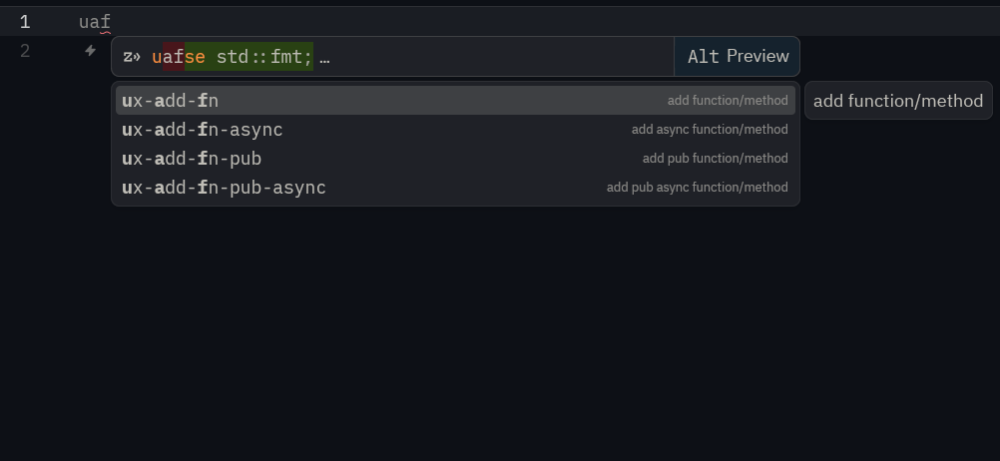
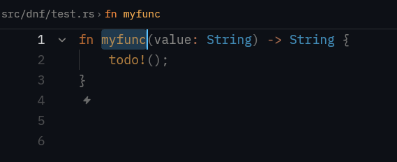

# Rust Snippets for Zed (**Ultimate Edition**)
A collection of Rust snippets to improve your development speed in the Zed IDE.

## Installation
This extension is designed to work with the Zed IDE. To install it, follow these steps:

1. Clone this repo:

```shell
git clone https://github.com/timlau/zed-rust-snippets
```

2. Go to the Extensions menu in the Zed IDE
3. Click "Install Dev Extension"
4. Select the folder you cloned

## Available Snippets

All snippets is prefixed `ux-` and is grouped be seached fast by typing the first letter in each group
Ex.`uaf` will select the `ux-add-fn` snippet.



